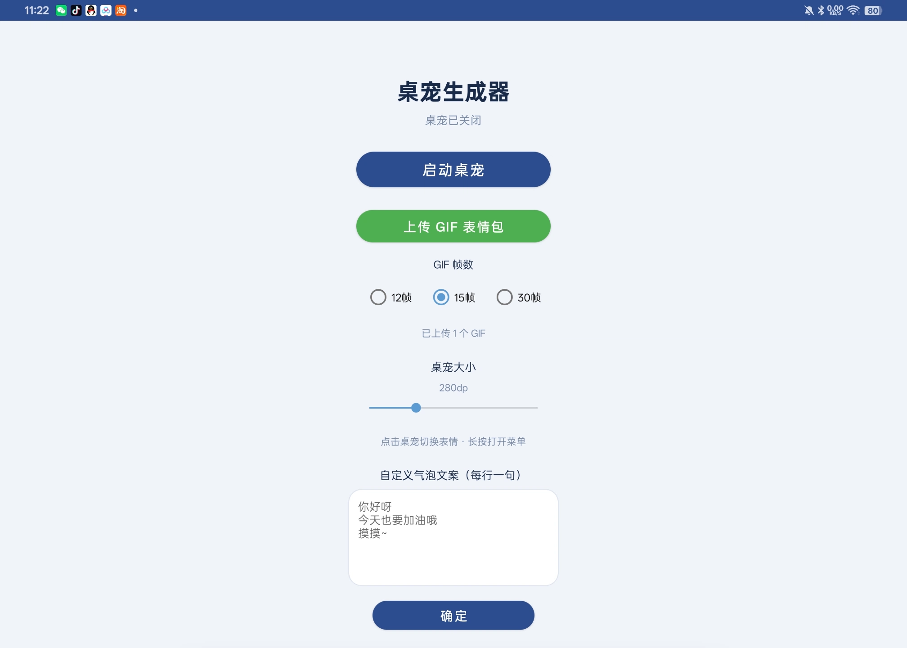
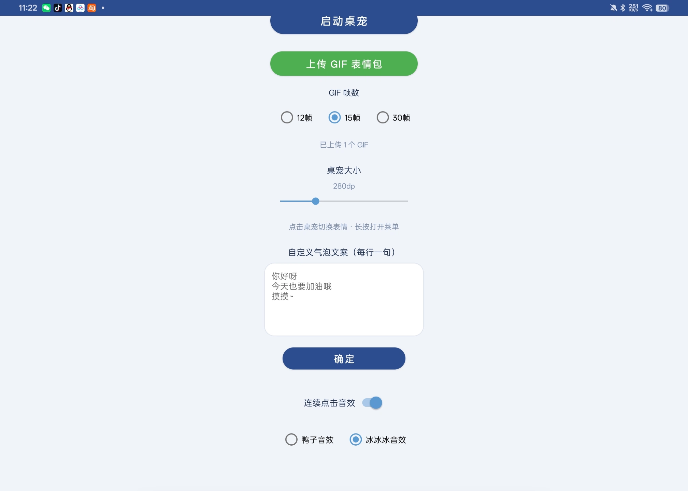

# Desktop Pet Generator

An Android desktop pet generator — upload any GIF sticker, and it becomes an interactive floating desktop pet.

> **This project is AI-assisted (Doubao)**. Code, icon generation scripts, and project structure were all completed by AI. Free to use, modify, and distribute.

## Download

**[Download the latest APK](https://github.com/fish133/pet-generator/releases/download/latest/pet-generator-latest.apk)** (v2.3.4, 4.7MB, release-signed)

Also available on the [Releases page](https://github.com/fish133/pet-generator/releases/tag/latest).

## Screenshots

| Main screen | Settings screen |
| --- | --- |
|  |  |

## Features

- **GIF to pet**: pick any GIF from your gallery, frames are extracted automatically
- **Frame count options**: choose 12 / 15 / 30 frames when uploading, balancing smoothness and detail
- **Tap to switch GIF**: tap the pet to play the next GIF
- **Tap sound effects**: optional duck or bing-bing sound, plays when you tap the pet
- **Long-press menu**: open emoji menu, switch idle GIF, long-press to delete, close the pet
- **Custom size**: slider from 80 to 800dp
- **Speech bubbles**: custom lines (one per line), popping up randomly every 10-40 seconds
- **Free drag**: hold and drag the pet anywhere on screen
- **Multi-GIF management**: switch on demand, memory-friendly (only loads the currently playing frames)

## Requirements

- Android 7.0 (API 24) and above, tested compatible with Android 16

## Usage

1. Install and open the app
2. Choose GIF frame count (12/15/30)
3. Tap "Upload GIF Sticker" and pick a GIF from your gallery
4. Wait for parsing to finish ("N frames extracted")
5. Tap "Start Pet" and grant the floating window permission
6. The pet appears on your screen

**Controls:** tap to switch GIF - long-press for menu - drag to move

**Sound effects:** below the bubble text on the main screen, enable "Tap Sound Effect" and choose Duck or Bing-bing.

## Changelog

### v2.3.4
- Security: broadcast receiver set to NOT_EXPORTED to prevent other apps from spoofing controls
- Logic: GIF frame estimation now has an iteration cap to prevent long GIFs from freezing
- Performance: replaced frequent new Thread with a thread pool
- Resources: removed READ_EXTERNAL_STORAGE (ineffective on Android 13+)
- Display: rewrote placeholder drawing coordinates so it is visible when no assets are loaded

### v2.3.3
- Fixed SeekBar crash on startup caused by out-of-range size storage
- Clamped stored size to the valid 80-800dp range

### v2.3.2
- Officially signed release (release keystore), no longer a debug certificate
- Installation no longer shows a security warning

### v2.3.1
- Fixed loadFramesForGif immediately recycling old Bitmaps causing animation thread black screen/crash
- Changed to delay recycling old frames by 500ms, waiting for the animation to switch before freeing memory

### v2.3.0
- Added tap sound effects: duck + bing-bing (choose one)
- Sound effect toggle below the bubble text, plays when tapping the pet
- Pet size range expanded to 80-800dp, default 280dp

### v2.2.2
- Fixed Bitmap recycling crash caused by loadFramesForGif multi-thread race
- getCurrentIdleFrames no longer does file I/O on the main thread
- MainActivity GIF count moved to a background thread

### v2.2.0
- Frame count selection (12/15/30) when uploading GIFs
- 12 frames smoother and lighter; 30 frames more detailed

### v2.1.0
- Package renamed: com.doubao.pet.littlewhale to com.petgen.app
- Theme renamed to Theme.PetGen
- Fixed long-press menu crash (removed theme attribute dependency)

## Building

Environment: JDK 17 + Android SDK (platform 34) + Gradle 8.2

```bash
pip install Pillow && python3 generate_icon.py
gradle assembleRelease
```

## Technical highlights

- Floating window: WindowManager + TYPE_APPLICATION_OVERLAY
- Foreground service: specialUse type, compatible with Android 14+
- GIF parsing: android.graphics.Movie frame extraction with uniform sampling
- Sound playback: SoundPool low latency, supports rapid tapping
- Memory optimization: on-demand frame loading, timely Bitmap recycling
- Broadcast communication: main screen to Service local broadcast (NOT_EXPORTED)

## Project structure

```
app/src/main/java/com/petgen/app/
├── MainActivity.kt          # Main screen
├── PetFloatingService.kt    # Floating window service
└── GifUtils.kt              # GIF parsing utilities
app/src/main/res/raw/
├── duck.mp3                 # Duck sound effect
└── bingbing.mp3             # Bing-bing sound effect
generate_icon.py             # Icon generation script
screenshot-main.png          # Main screen screenshot
screenshot-settings.png      # Settings screen screenshot
.github/workflows/build.yml  # Auto-release APK
```

## License

MIT License
